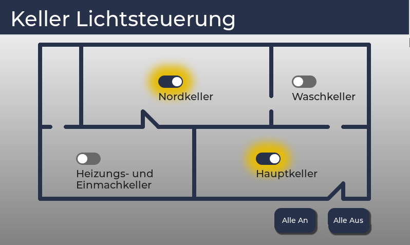

Code for the UI seen below except the line widget, this was handcoded in another file.
The UI is for 800x480 displays.

This is just to showcase what the converter puts out, in my case it is completely valid berry without manual fixes. You mileage may vary.

